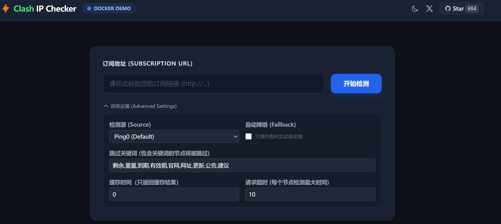
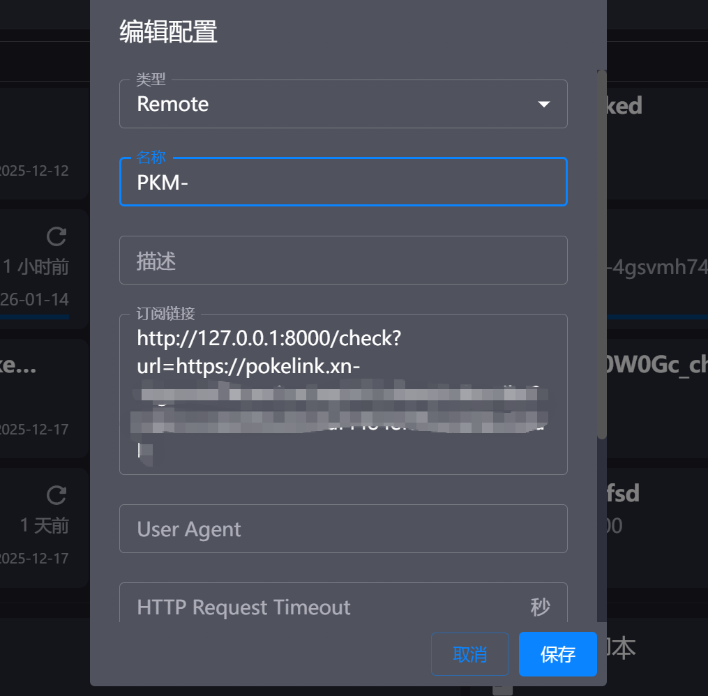

# ⚡ Clash IP Checker 👉 [Docker Demo](https://tombcat.space/ipcheck)

一个基于 **Clash Meta (Mihomo)** 和 **FastAPI** 的高性能 IP 风险检测工具，
专为筛选高质量节点设计，提供 API 订阅转换服务 和 Web 可视化面板。

> **功能亮点**: 相对于[main分支](https://github.com/tombcato/clash-ip-checker/tree/main)而言，Docker版部署后代理切换不占用影响本地网络，且能直接输入订阅链接输出新订阅链接，没有繁琐的使用步骤，正真做到一键替换

---

## 核心功能

*   **API 订阅转换**: 可直接拼成带检测结果的订阅链接替换原始订阅， 可多次刷新该链接，IP检测结果会通过该链接增量更新
    *   👉 **订阅格式**:   
    本地docker服务： `http://127.0.0.1:8000/check?url=[原始订阅链接]`  
    云服务器： `http://[服务器IP]:8000/check?url=[原始订阅链接]`
*   **Web 可视化面板**: 现代化的 Vue/Tailwind 界面，实时显示检测进度和日志。
    *   👉 **访问地址**:   
        本地docker服务：`http://127.0.0.1:8000/ipcheck`  
        云服务器：`http://[服务器IP]:8000/ipcheck`
*   **智能缓存系统**:
    *   基于内容 MD5 的去重缓存 (默认1小时有效期)。
    *   **任务复用**: 多个用户同时请求相同订阅时，共享同一个检测任务
*   **队列保护**: 内置任务队列限制 (默认 10 并发)，防止服务器过载

## 🚀 快速开始

### 使用 Docker Compose 

最简单的部署方式。只需一条命令：

```bash
# 1. 克隆代码
git clone https://github.com/tombcato/clash-ip-checker.git
cd clash-ip-checker

# 2. 切换Docker分支
git checkout docker

# 3. 启动服务
docker-compose up -d --build
```

启动后，访问 **[http://127.0.0.1:8000/ipcheck](http://127.0.0.1:8000/ipcheck)** 即可使用。  
我自己云部署的Demo【仅测试】: https://tombcat.space/ipcheck


也可以直接在Clash中添加替换的订阅链接 `http://127.0.0.1:8000/check?url=[原始订阅链接]`, 添加后通过刷新订阅看到检测结果，订阅不多的话一般一分钟可以完全检测完成，未完成的话可以继续刷新，直到检测完成，也可前往 http://127.0.0.1:8000/ipcheck 查看进度



如要部署到Google Cloud (GCP)详见部署指南：[📄 DEPLOY_GCP.md](./DEPLOY_GCP.md)

---

## 🛠️ 配置说明 (`core/config.py`)

可通过环境变量或修改 `config.yaml` 调整行为：

| 环境变量 | 默认值 | 说明 |
| :--- | :--- | :--- |
| `MAX_QUEUE_SIZE` | `10` | 最大并发检测任务数。超过限制时将降级为只下载不检测。 |
| `MAX_AGE` | `3600` | 缓存有效期 (秒)。 |


---

## 🔒 隐私与免责

*   **数据隐私**: 本工具仅作为网络连接性测试用途
*   **免责申明**: 本项目按“现状”提供，开发者不对因使用本工具导致的任何后果（如流量消耗、账号封禁等）负责。请务必遵守当地法律法规。

