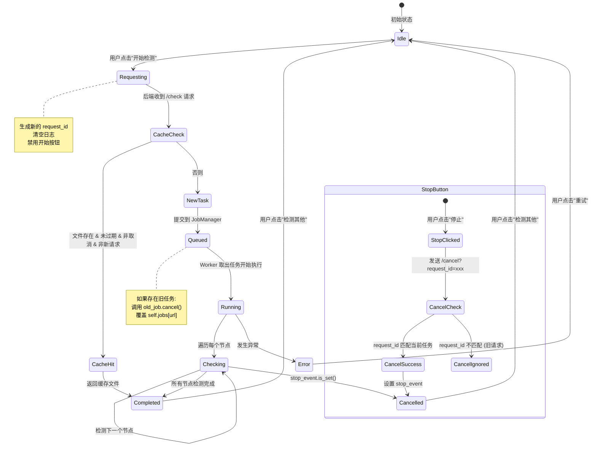
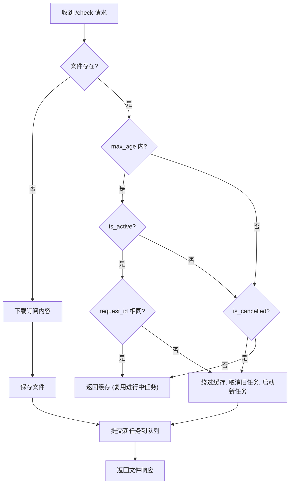
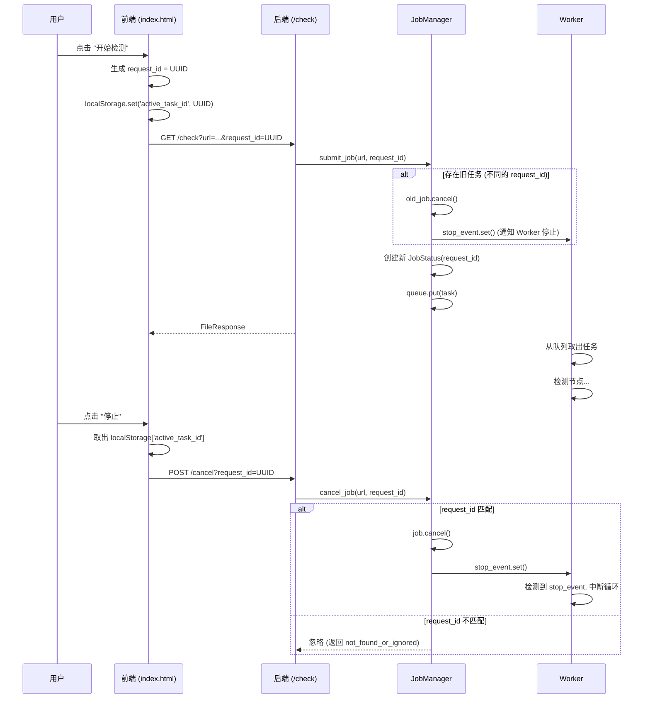

# Clash IP Checker - 任务状态流程图

## 任务生命周期状态图

## 缓存决策流程图

## request_id 机制说明

## JobStatus 状态定义

| 状态 | 描述 | 触发条件 |
|-----|------|---------|
| `queued` | 任务已提交，等待 Worker 处理 | `submit_job()` 创建 |
| `running` | Worker 正在执行检测 | `update_progress()` 调用 |
| `completed` | 所有节点检测完成 | `complete()` 调用 |
| `cancelled` | 用户主动取消 | `cancel()` 调用 |
| `error` | 检测过程发生异常 | `fail()` 调用 |

## 关键设计决策

1. **request_id 隔离**: 每次点击"开始检测"生成唯一 UUID，确保取消操作只影响对应的任务
2. **旧任务自动取消**: 当新请求覆盖旧任务时，先调用 `cancel()` 通知 Worker 停止
3. **缓存绕过**: 即使缓存有效，如果 `request_id` 不同，也会启动新任务
4. **日志清理**: 前端在开始新任务时清空旧日志，避免混淆
